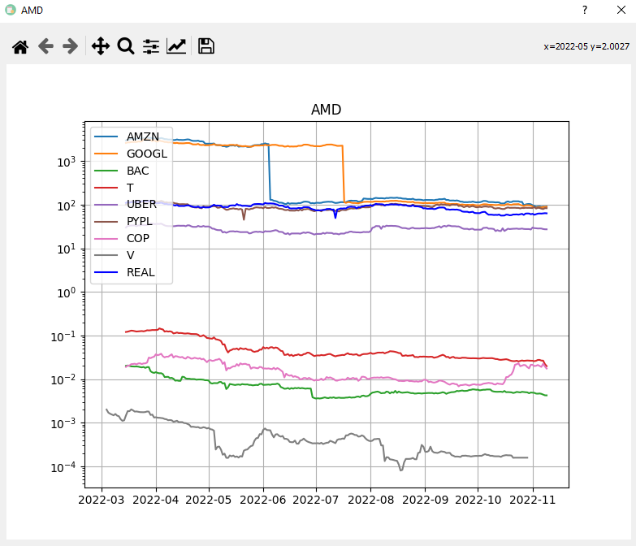

# Market-Notes

## Назначение проекта

**Market Notes** – десктопное приложение для создания заметок, объединённое с инструментами анализа финансовых рынков (криптовалют/акций). Проект позволяет пользователю вести записи и одновременно получать информацию о криптовалютных графиках, что удобно для трейдеров и инвесторов при фиксации своих идей и наблюдений. Также к графикам можно применить ряд изменений (наложение сразу нескольких активов, индикаторов и т. д.)

## Основные возможности

- **Создание и управление заметками:** Пользователь может создавать новые заметки, редактировать и удалять существующие. Заметки могут содержать текстовую информацию о рыночных наблюдениях, стратегиях или любых других данных.
- **Анализ графиков:** Приложение интегрировано с сервисами получения биржевых данных и позволяет отображать графики цен криптовалют в реальном времени. Пользователь может выбрать интересующую криптовалюту и временной интервал, чтобы увидеть соответствующий ценовой график.
- **Технические индикаторы:** Встроена возможность построения популярных технических индикаторов – таких как SMA (простая скользящая средняя), EMA (экспоненциальная скользящая средняя), RSI (индекс относительной силы) и др. Эти индикаторы накладываются на график, помогая в анализе трендов и моментов рынка.
- **Хранение данных:** Все заметки и связанные данные сохраняются в локальной базе данных (SQLite), что обеспечивает надёжность хранения и автономность работы приложения.
- **Удобный интерфейс:** Приложение имеет графический интерфейс на базе библиотеки PyQt5. Предусмотрена поддержка горячих клавиш и других элементов UX для быстрого доступа к функциям (например, переключение между заметками, обновление графиков и пр.).

## Используемые технологии

**Python, PyQt5, SQLite, yfinance, pandas, matplotlib, investpy**

- **Python 3.x:** Язык программирования, на котором реализована логика приложения.
- **PyQt5:** Фреймворк для создания графического интерфейса пользователя (GUI). Обеспечивает нативный вид приложения на Windows/Linux и удобство взаимодействия с функциями программы.
- **SQLite3:** Встроенная реляционная база данных для локального хранения заметок и конфигурационных данных. Не требует развёртывания сервера и отлично подходит для десктоп-приложения.
- **Библиотеки для работы с рынками:**
  - `yfinance`: библиотека для получения исторических и текущих данных по ценам финансовых инструментов (в том числе акций и криптовалют) через Yahoo Finance API.
  - `investpy`: библиотека для извлечения финансовой информации (например, с Investing.com) – может использоваться для альтернативных источников данных.
- **Pandas и Matplotlib:** `pandas` применяется для обработки табличных данных и расчёта технических индикаторов, `matplotlib` – для построения графиков цен и индикаторов непосредственно в интерфейсе приложения.

## Скриншоты





## Структура проекта

```bash
market-notes/
├── main.py               # Основной исполняемый файл приложения (запуск GUI)
├── BASE.db               # Файл базы данных SQLite, где хранятся заметки и настройки
├── Templates/            # Директория с шаблонами интерфейса (UI-файлы для PyQt5)
│   ├── main_window.ui    # Например, описание главного окна в Qt Designer
│   └── ...               # Другие шаблоны UI (формы добавления заметки и пр.)
├── requirements.txt      # Список зависимостей (библиотек Python) для проекта
└── README.md             # Документация проекта (данный файл README)
```

## Установка и запуск

1. **Клонирование репозитория:**
   ```bash
   git clone https://github.com/MegoM2323/Market-Notes.git
   cd Market-Notes
   ```
2. **Установка зависимостей:** Убедитесь, что у вас установлен Python 3, затем выполните установку требуемых библиотек:
   ```bash
   pip install -r requirements.txt
   ```
3. **Запуск приложения:** После успешной установки зависимостей, запустите главный файл:
   ```bash
   python main.py
   ```

## Лицензия

Лицензия не указана. (По умолчанию, все права на исходный код принадлежат автору проекта.)
